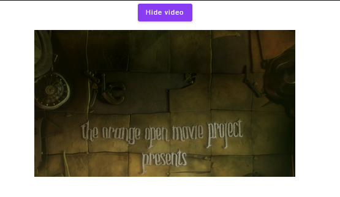
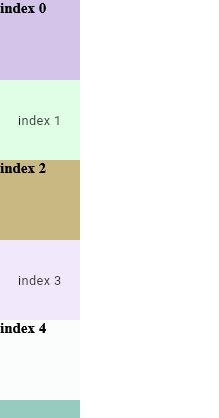
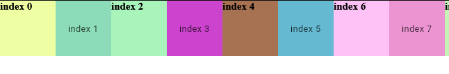

This is a Kotlin Multiplatform project targeting Web.

the main purpose of the project is make the HTML and COMPOSE WEB interop

How to install 

1. Add it in your root build.gradle at the end of repositories
         
         dependencyResolutionManagement {
   	        repositoriesMode.set(RepositoriesMode.FAIL_ON_PROJECT_REPOS)
   	        repositories {
                   mavenCentral()
                   maven { url 'https://jitpack.io' }
   	        }
         }

2. Add the dependency

         dependencies {
             implementation("com.github.Hamamas:Kotlin-Wasm-Html-Interop:Version")
         }

3. Add this to your **[index.html](composeApp/src/wasmJsMain/resources/index.html)**
    
    `

`

4. Provide the root element in this case is the div we added on the index

        CompositionLocalProvider(LocalLayerContainer provides document.getElementById("components")!!)

5. Add Html view 

         HtmlView(
            modifier = Modifier.fillMaxWidth().height(300.dp),
            factory = {
                val video = document.createElement("video")
                video.setAttribute(
                    "src",
                    "http://commondatastorage.googleapis.com/gtv-videos-bucket/sample/ElephantsDream.mp4"
                )
                video
            }
        )

**AnimatedVisibility**

        var visibility by remember { mutableStateOf(false) }
        Column(
            modifier = Modifier.fillMaxSize(),
            verticalArrangement = Arrangement.spacedBy(12.dp),
            horizontalAlignment = Alignment.CenterHorizontally
        ) {
            Button(onClick = { visibility = visibility.not() }) {
                Text(if (visibility) "Hide video" else "Show video")
            }
            AnimatedVisibility(visibility) {
                HtmlView(
                    modifier = Modifier.fillMaxWidth().height(300.dp),
                    factory = {
                        val video = document.createElement("video")
                        video.setAttribute(
                            "src",
                            "http://commondatastorage.googleapis.com/gtv-videos-bucket/sample/ElephantsDream.mp4"
                        )
                        video
                    }
                )
            }
        }

**LazyColumn**

        LazyColumn(modifier = Modifier.fillMaxSize()) {
            items(50) {
                if (it % 2 < 1) {
                    HtmlView(
                        modifier = Modifier.size(100.dp).background(randomColor),
                        factory = {
                            val element = document.createElement("h3")
                            element.textContent = "index $it"
                            element
                        }
                    )
                } else {
                    Box(
                        modifier = Modifier.size(100.dp).background(randomColor),
                        contentAlignment = Alignment.Center
                    ) {
                        Text(text = "index $it")
                    }
                }
            }
        }

**LazyRow**

        LazyRow(modifier = Modifier.fillMaxSize()) {
            items(50) {
                if (it % 2 < 1) {
                    HtmlView(
                        modifier = Modifier.size(100.dp).background(randomColor),
                        factory = {
                            val element = document.createElement("h3")
                            element.textContent = "index $it"
                            element
                        }
                    )
                } else {
                    Box(
                        modifier = Modifier.size(100.dp).background(randomColor),
                        contentAlignment = Alignment.Center
                    ) {
                        Text(text = "index $it")
                    }
                }
            }
        }

